# Configuração de ambiente Windows para desenvolver com React Native

## instalar vs code

https://code.visualstudio.com/

## Instalar extenções

- vscode-icons
- Color Highlight
- editorconfig - Editor config for vscode
- eslint
- prettier
- rocketseat React Native

## Alterar o settings.json do vscode

```
Ctrl + shift + p
```

escolha a opção `preferences: Open Settings (JSON)` e cole o trecho abaixo dentro do arquivo

```json
{
  "editor.lineHeight": 20,
  "editor.formatOnSave": true,
  "editor.rulers": [80, 120],
  "editor.tabSize": 2,
  "editor.renderLineHighlight": "gutter",
  "terminal.integrated.fontSize": 14,
  "emmet.syntaxProfiles": {
    "javascript": "jsx"
  },
  "emmet.includeLanguages": {
    "javascript": "javascriptreact"
  },
  "javascript.updateImportsOnFileMove.enabled": "never",
  "breadcrumbs.enabled": true,
  "editor.parameterHints.enabled": true
}
```

## Baixar e instalar Dev Docs App

https://devdocs.egoist.sh/

## Instalar chocolatey

https://chocolatey.org/

Execute o PowerShel como administrador e execute o comando:

```
Set-ExecutionPolicy Bypass -Scope Process -Force; iex ((New-Object System.Net.WebClient).DownloadString('https://chocolatey.org/install.ps1'))

```

## Instalar NodeJS

Ainda com o Power Shel aberto, execute:

```
cinst nodejs
```

## Instalar Yarn

```
choco install yarn
```

## Instalar Python e JDK

```
choco install -y nodejs.install python2 jdk8
```

## Instalar do React Native CLI

```
yarn global add react-native-cli
```

## Baixe e instale o Android Studio

Ele será importante somente para as configurações do Android e Emulador.

https://developer.android.com/studio/#downloads

## Definir path do SDK

Abra o Android Studio e vá até as configurações

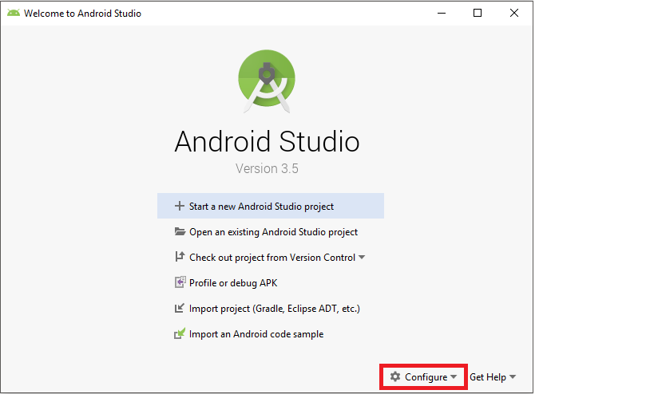

Copie o caminho do SDK:

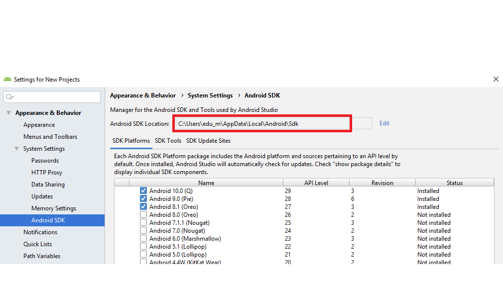

Adicione nas variáveis de ambiente como `ANDROID_HOME`:

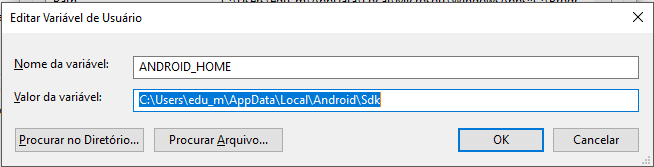

Adicione `%ANDROID_HOME%\platform-tools`, `%ANDROID_HOME%\tools` e `%ANDROID_HOME%\emulator` ao Path.

ATENÇÂO, na imagem abaixo está faltando o `emulator`, mas ele também é importante.

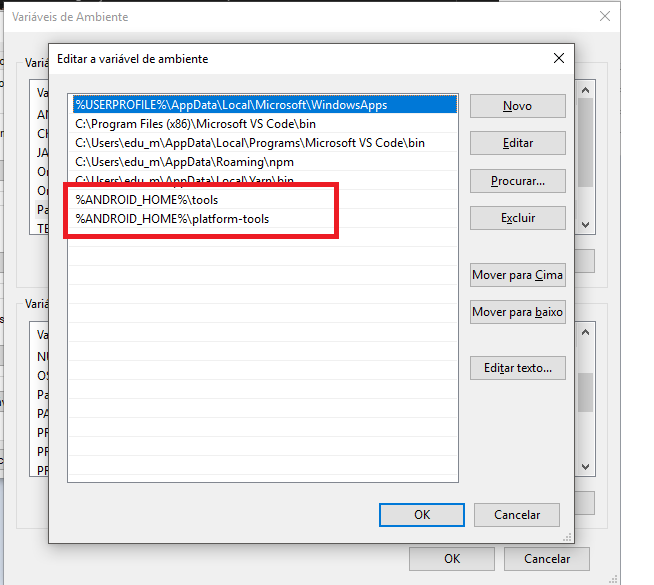

Reinicie o computador.

## Instale a versão 9.0 da plataforma Android

Vá até p SDK Manager:

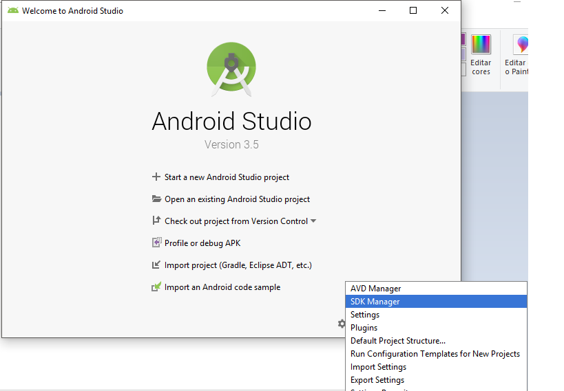

Selecione a versão 9.0 e instale.

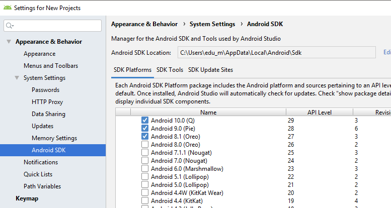

# Crie um AVD

Abra do Gerenciador de Dispositivos Virtuais:

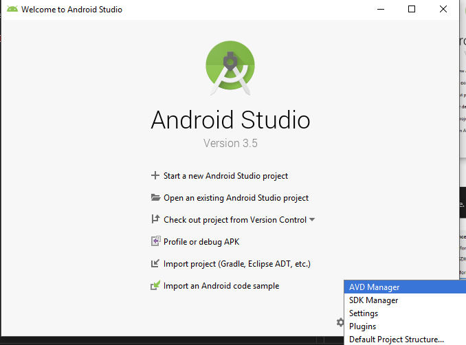

Na tela qeu se abrirá, clique no botão 'create virtual device':

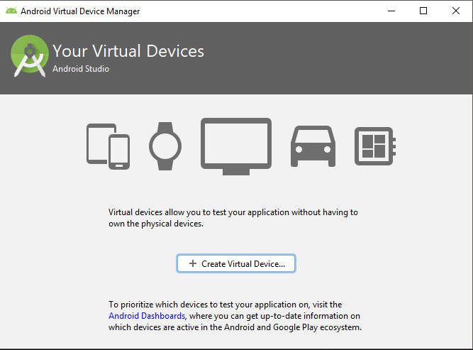

Escolha uma configuração de aparelho de sua preferência:

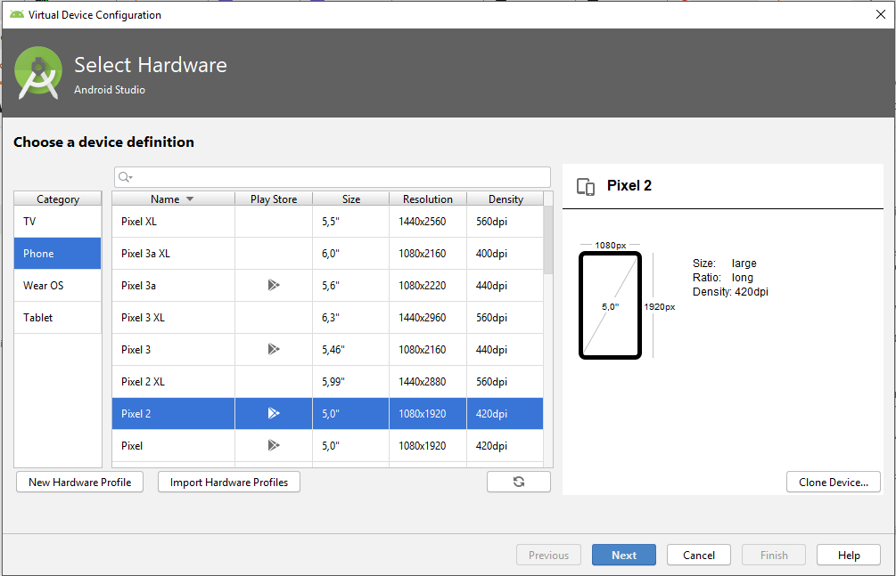

Clique em next e escolha um imagem para ser instalada no AVD.

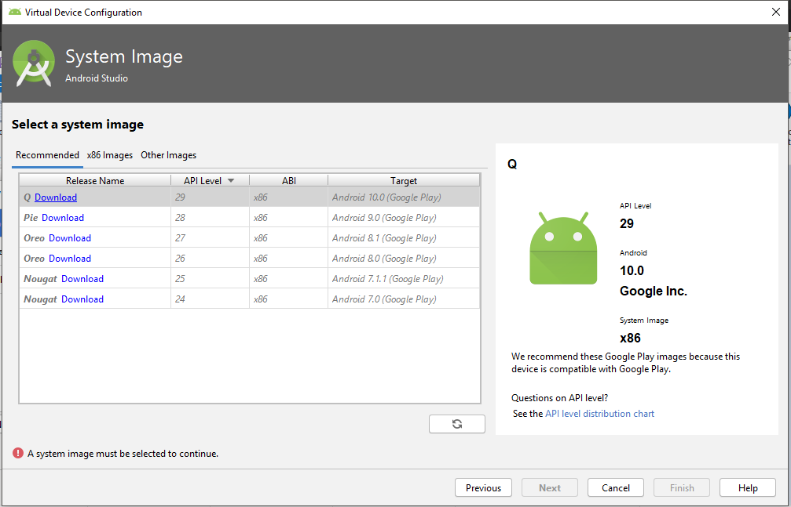

Faça o download da imagem e instale.
Após a instalação, selectione a imagem e clique em 'Next'.

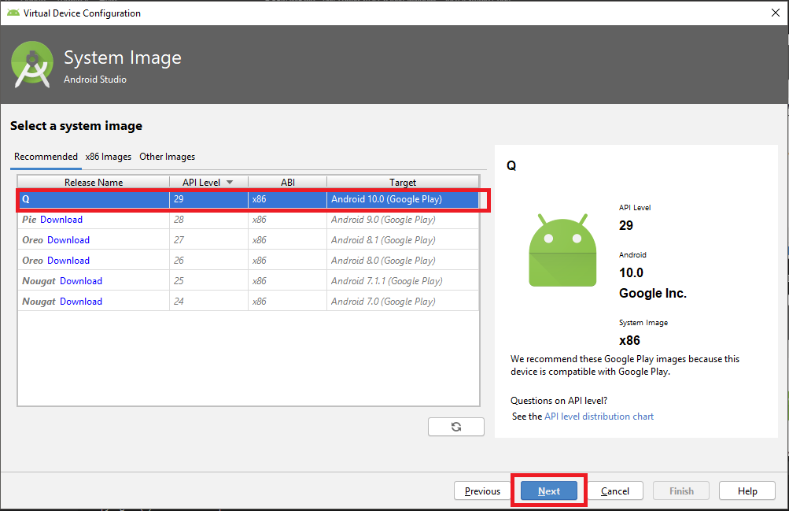

Dê um nome simples para o seu AVD, vamos precisar do nome para executar futuramente:

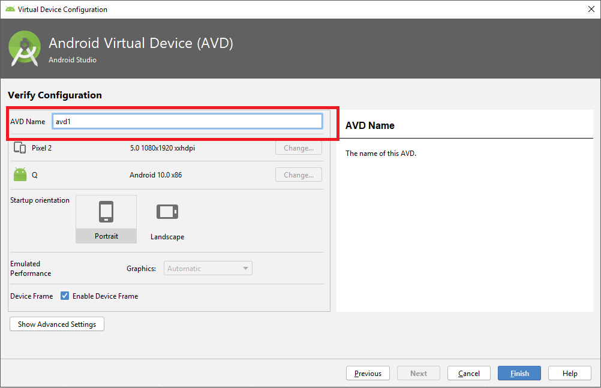

Clique em 'Finish' e feche o Android Studio.

## Criando o primeiro projeto em React Native

Abra um prompt de comando e execute um emulador:

```
%ANDROID_HOME%/emulator/emulator -avd <nome do avd que criou>
```

Abra outro prompt de comando e navegue até o diretóro onde seu projeto irá ficar:

Digite:

```
react-native init MyFirstApp
```

O processo de criação pode demorar alguns minutos, então aguarde.

Entre na pasta do projeto.

```
cd MyFirstApp
```

execute o comando abaixo para executar o serviço de desenvolvimento do React Native.

```
react-native start
```

Deixe executando, abra mais um prompt de comando e navegue até o diretório onde criou o projeto e execute:

```
react-native run-android
```

Esse comando pode demorar até 10 minutos na primeira vez, mas daqui pra frente o desenvolvimento será bem mais rápido.

Espero vocês na primeira turma do GoMob!

Eduardo Sutil
